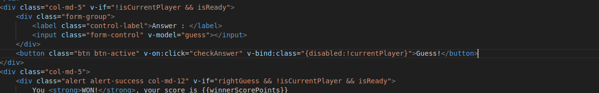

# Implementation-journal-Pictionary(Removing Bugs and UI Improvement)

## Prequisite
1. git installed on your operating system.
2. node.js installed on your operating system.
3. Vscode or any Code Editor.
4. Browser Application like chrome, firefox
5. basic knowledge on linux commands

## Step-1 
open the terminal and put this command -> `git  clone  https://github.com/SupremeMagus/Pictionary.git ` 

### Example :   

### Ouput

**After this  Pictionary  folder will be created, To Check if the folder is created we can use ls command** 

### Explanation
This command clones the Pictionary repository from GitHub to your local machine. It creates a folder named Pictionary and downloads all the repo files into it

## Step-2
Put this command in the terminal -> `cd Pictionary/ && code` 

### Example :   

### Ouput
**Vscode is open with Pictionary folder**  

### Explanation
This command navigates into the Pictionary folder and opens the directory in Visual Studio Code.

## Step-3

Open draw.js by clicking on on filename on left panel of vscode as shown below

## Step-4
**Move all the code of init function outside and remove init function from the code.**

### Before
  

### After Moving the Code Out side

### After Removing init function

## Step-4

Remove var main = {} code from the draw.js

 

## Step-5

Add var keyword before main= new Vue... 

### Before 

### After

## Step-6

Open start.html by clicking on the filename on the left panel of vscode. 

## Step-7

Add defer attribute on the script tag with src="js/draw.js"

### Before

### After

## Step-8 

Remove onload attribute from body tag

### Before

### After

## Step-9

In the draw.js file, we can find main variable which is initialized with Vue constructor
with a object passed as an argument, inside that object we can see  a key with name **data** and object with lot of keys as it value.
we have to add new key called isGuessed key with value false in it.

### Before 

### After

### Step-10
Now In same object as previously where we found key name data,we can find key name **methods** with lot properties in it.  
In the property called checkAnswer, we have to add single line code.   
`this.isGuessed = true`  

### Before 

### After

## Step-11

In draw.js we can find `socket.on("gameOver),We have to add the follwing code 
`main.isGuessed=false`

### Before 

### After

## Step-12

In draw.js we can find `socket.on("getWinner),We have to add the follwing code .  
`main.isGuessed=false` 

### Before

### After

## Step-13
Now open start.html file,in the bottom of code we can find div tag with content Wrong Guess. 
We have make changes in the value i**v-if=""**  attribute.  
we have to add  `&& isGuessed` 

### Before

### After

## Step-13

In the start.html file, we can find a button tag with content Guess!.
We have to add a new attibute and value in it like below.  
`v-bind:class="{disable:!currentPlayer}"`

### Before

### After

## Step-14 

Open the terminal and make sure u are in the Pictionary folder in terminal

Now run the command --> `npm install`

after you get the above ouput
Make sure you have installed nodejs in your system.
Now run the command --> `node index.js`

## Step-15

Open your browser and type the url `http://localhost:1234/` in the address bar.  
Now Homepage of Pictionary appliation appears.  
Game requires atleast 3 user to play the game.  
we can open 2 more new tabs with  url `http://localhost:1234/`  in their address bar to play the game.

